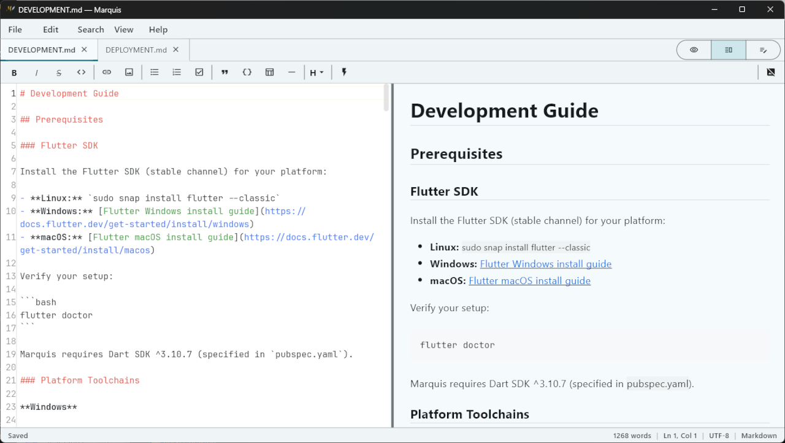
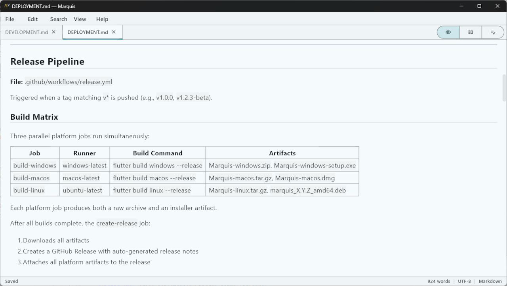
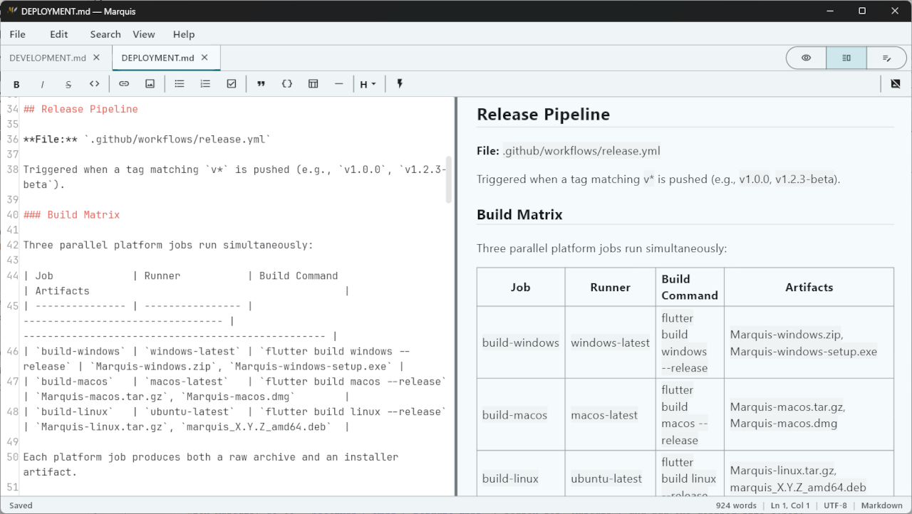
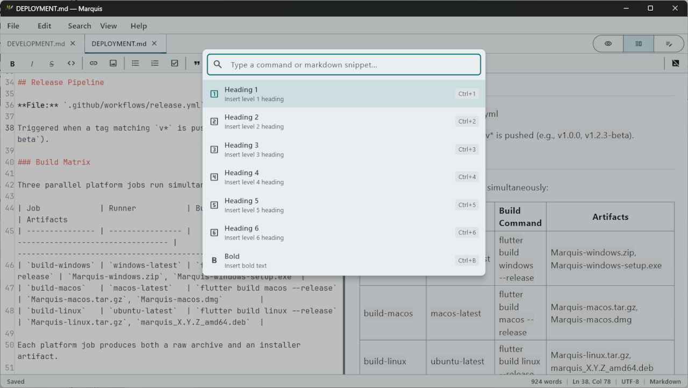
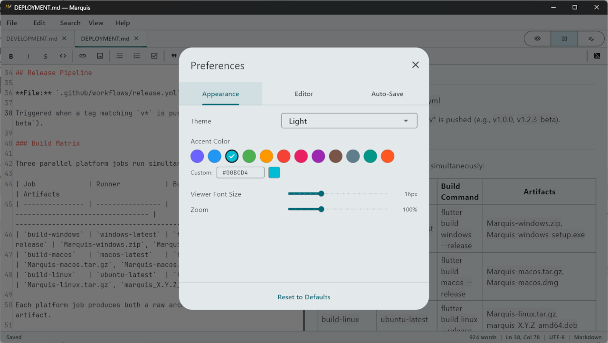
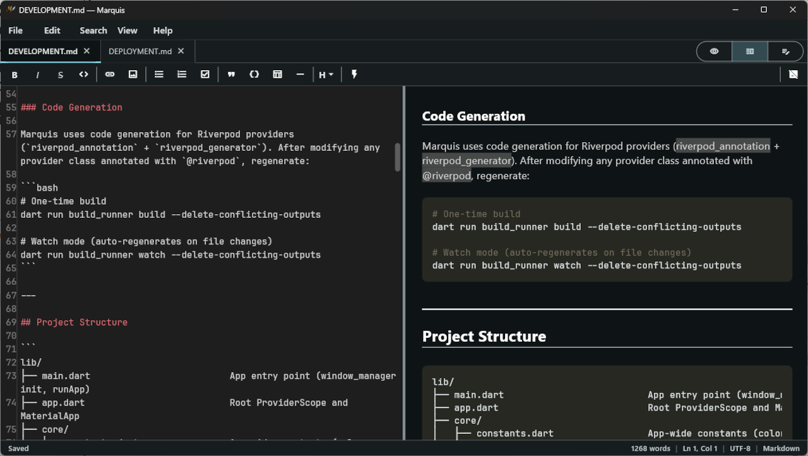

# Marquis de Editeur

**Marquis de Editeur, the Noble Markdown Editor** — a cross-platform desktop app for viewing and editing Markdown files. Marquis provides a split-view interface with a plain-text editor on the left and a live-rendered Markdown viewer on the right. It can also be used to simply view Markdown files without editing them.

<!-- Hero screenshot: Split View showing editor on the left and live preview on the right,
     with a document that demonstrates headings, code blocks, and lists.
     Capture at 1280x800 or similar 16:10 aspect ratio. -->



## Features

- **Live Preview** — Instant rendering as you type, with GitHub Flavored Markdown support
- **Three View Modes** — Viewer Only (default), Split View, and Editor Only
- **Tabbed View/Editing** — Open multiple files with drag-to-reorder tabs and context menus
- **Command Palette** — Quick access to every command and Markdown snippet via `Ctrl+/`
- **Find & Replace** — Search within the editor and viewer with regex support
- **Auto-Save** — Configurable debounced saving with visual status indicator
- **File Watching** — Detects external changes and prompts to reload or keep your version
- **Printing** — Renders Markdown to formatted PDF for native print dialogs
- **Themes** — Light, Dark, and System themes with customizable accent color
- **Preferences** — User-editable JSON config for full control over editor behavior
- **File Association** — Registers as a handler for `.md` and `.markdown` files
- **Cross-Platform** — Runs natively on Windows, macOS, and Linux

## Releases

The latest release can be found here: [Latest Release](https://github.com/mchase-dev/Marquis/releases/latest).

- **Windows:** Download and run `Marquis-windows-setup.exe`, or extract `Marquis-windows.zip` for a standalone executable
  > **Note:** On Windows 11, file associations may not be set automatically by the installer. To associate `.md` and `.markdown` files with Marquis, go to **Settings > Apps > Default apps**, search for "Marquis", and add the desired file types.
- **macOS:** Download and open `Marquis-macos.dmg`, or extract `Marquis-macos.tar.gz`
- **Linux:** Download and install `marquis_X.Y.Z_amd64.deb`, or extract `Marquis-linux.tar.gz`

## Screenshots

### View Only

The default viewing experience: formatting markdown viewing.

<!-- Show read-only view with a document. Light theme. -->



### Split View

The default editing experience: plain-text editor on the left, live preview on the right.

<!-- Show Split View with a document containing headings, bold/italic text,
     a code block, and a list. Light theme. -->



### Command Palette

Type to search for any command or Markdown snippet. Keyboard-driven workflow.

<!-- Show the command palette overlay with a partial search query typed,
     showing filtered results with icons. -->



### Preferences

Customizable editor and viewer settings stored as an editable JSON file.

<!-- Show the Preferences dialog with theme, font size, accent color,
     and auto-save settings visible. -->



### Dark Theme

Full dark theme support with syntax-highlighted code blocks.

<!-- Show Split View in dark theme with a Markdown document containing
     a fenced code block to showcase syntax highlighting. -->



## Quick Start

### Prerequisites

- [Flutter SDK](https://docs.flutter.dev/get-started/install) (stable channel, Dart SDK ^3.10.7)
- Platform toolchain for your target (see [Development Guide](docs/DEVELOPMENT.md))

### Build & Run

```bash
git clone https://github.com/mchase-dev/Marquis.git
cd Marquis
flutter pub get
dart run build_runner build --delete-conflicting-outputs
flutter run -d windows   # or: -d macos, -d linux
```

See the [Development Guide](docs/DEVELOPMENT.md) for detailed setup instructions per platform.

## Architecture

```
lib/
├── main.dart / app.dart       App entry and root widget
├── core/                      Constants, utilities, extensions
├── models/                    Immutable state classes with copyWith()
├── providers/                 Riverpod providers (code-generated)
├── services/                  File I/O, preferences, printing, autosave
├── widgets/                   UI components organized by feature
└── theme/                     App, editor, and viewer themes
```

**Key technologies:**

- **State Management:** Riverpod with `@riverpod` annotations and code generation
- **Editor:** `re_editor` + `re_highlight` — custom rendering engine, not TextField-based
- **Viewer:** `markdown_widget` — GFM support, TOC, syntax-highlighted code blocks
- **Window:** `window_manager` — min size enforcement, close-intercept, state persistence
- **Models:** Manual immutable classes with `copyWith()` (no Freezed)

**Storage philosophy:** Preferences are stored as a user-editable JSON file at platform-specific paths (`%APPDATA%\Marquis\`, `~/Library/Application Support/Marquis/`, `~/.config/Marquis/`). No database, no cloud sync.

## Documentation

| Document                                 | Description                                               |
| ---------------------------------------- | --------------------------------------------------------- |
| [Development Guide](docs/DEVELOPMENT.md) | Setting up the development environment, building, testing |
| [Deployment Guide](docs/DEPLOYMENT.md)   | CI/CD, release process, platform builds                   |
| [Design Document](DESIGN_DOCUMENT.md)    | Complete specification and architectural decisions        |

The in-app **Help > User Guide** provides end-user documentation including formatting shortcuts, view modes, and preferences.

## Keyboard Shortcuts

| Shortcut            | Action            |
| ------------------- | ----------------- |
| `Ctrl+N`            | New file          |
| `Ctrl+O`            | Open file         |
| `Ctrl+S`            | Save              |
| `Ctrl+Shift+S`      | Save As           |
| `Ctrl+W`            | Close tab         |
| `Ctrl+E`            | Toggle Split View |
| `Ctrl+Shift+E`      | Editor Only       |
| `Ctrl+/`            | Command Palette   |
| `Ctrl+F`            | Find              |
| `Ctrl+H`            | Find & Replace    |
| `Ctrl+P`            | Print             |
| `Ctrl+,`            | Preferences       |
| `Ctrl+=` / `Ctrl+-` | Zoom in / out     |
| `Ctrl+0`            | Reset zoom        |
| `F11`               | Full screen       |

See the in-app User Guide (**Help > User Guide**) for the complete shortcut reference including formatting shortcuts.

## Testing

Marquis has 85 tests across 8 test files covering models, core utilities, and widget smoke tests.

```bash
flutter test                           # Run all tests
flutter test test/models/              # Run model tests only
flutter test --reporter expanded       # Verbose output
flutter analyze                        # Static analysis
```

## CI/CD

- **CI Pipeline:** Runs `flutter analyze` and `flutter test` on every push/PR to `main`
- **Release Pipeline:** Tag a version (`v1.0.0`) to trigger multi-platform builds and create a GitHub Release with artifacts for all 3 platforms

See the [Deployment Guide](docs/DEPLOYMENT.md) for details.

## License

MIT License. Copyright 2026 Mark Chase.
